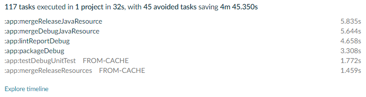

# android + gradle sample

[Buildless][1], [Android][2], and [Gradle][3].


| Uncached build (**1 minute  25 seconds**)                | Cached build (**31 seconds**)                            |
|----------------------------------------------------------|----------------------------------------------------------|
|  |  |


## Details about this sample

Together, these tools provide an Android development environment, enabled with blazing-fast remote build caching. Buildless handles build caching for the app.


### Additional resources

- [Buildless docs: Gradle setup][4]


## Trying the sample

> **Before you start:** Obtain an API key for [Buildless][1], set it at `BUILDLESS_APIKEY` in your environment

1) Clone the sample
2) Run a build with `./gradlew build`; observe that Gradle uses Buildless

That's it! Enjoy lightning-fast builds on Android 🔥


### Building and running the app

> To build the Android app:
```
./gradlew build
```

> To run the Android app:
```
Launch an emulator ->
```
```
./gradlew installDebug
```


## Using the sample for your own codebase

This is a [GitHub Template repository][5]; you can easily use it to create your own repo. Follow these steps to customize it
for use with your Buildless account:

1) Update `.github/CODEOWNERS`
2) Add a [GitHub Secret][6] called `BUILDLESS_APIKEY`, set to the API key you want to use in CI
3) That's it!


### Sharing an API key across an organization

You can use [Organization Secrets][7] to automatically provide a `BUILDLESS_APIKEY` to all your repos.


[1]: https://less.build
[2]: https://www.android.com/
[3]: https://gradle.org/
[4]: https://docs.less.build/docs/gradle-project-setup
[5]: https://docs.github.com/en/repositories/creating-and-managing-repositories/creating-a-repository-from-a-template
[6]: https://docs.github.com/en/actions/security-guides/using-secrets-in-github-actions
[7]: https://docs.github.com/en/actions/security-guides/using-secrets-in-github-actions#creating-secrets-for-an-organization